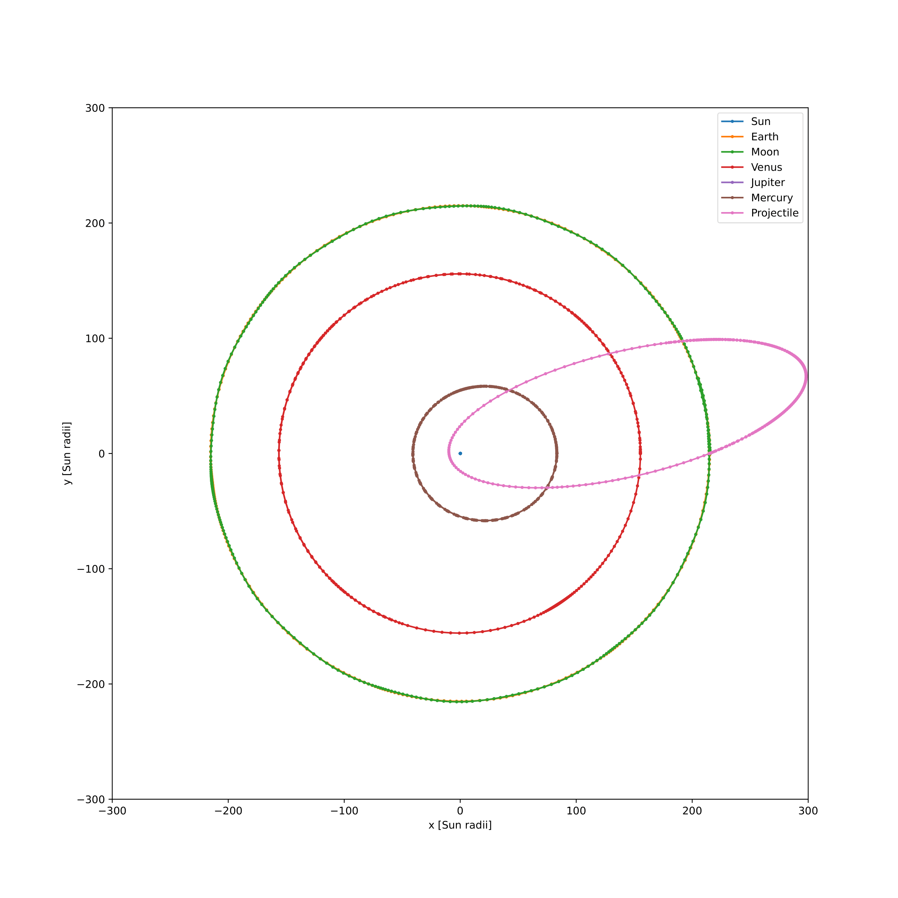

# SpinLaunch

Welcome to the SpinLaunch repository! This project aims to simulate trajectories starting on Earth with very high energy without the use of rocket propulsion.

## Introduction

The goal of this project is to explore alternative methods for launching payloads into space without traditional rocket propulsion. By simulating trajectories with high energy from Earth's surface, we aim to study the feasibility and potential of such launch mechanisms.

## Results

### Heliocentric View

Figure 1: This figure shows a trajectory in a heliocentric view, illustrating the path of the simulated object relative to the Sun.

Figure 2: This figure shows a trajectory in a heliocentric view, illustrating the path of the simulated object relative to the Sun. Direct sun hit.

### Geocentric View

Figure 3: This figure provides a geocentric point of view, showing the trajectory of the object with respect to the Earth.

### Grid of Trajectories

Figure 4: This figure displays a grid of trajectories with different starting velocities and angles. The colorbar indicates the distance to the Sun, with red denoting a direct hit.

### Trajectory Grid with Termination Reasons

Figure 5: Similar to Figure 4, this figure shows a grid of trajectories, but the colors denote the reason why the simulation stopped.

For a more detailed description, please see the upcoming paper.

### Libraries and Versions
python==3.10.13
matplotlib==3.8.0
numpy==1.24.3
scipy==1.11.4

